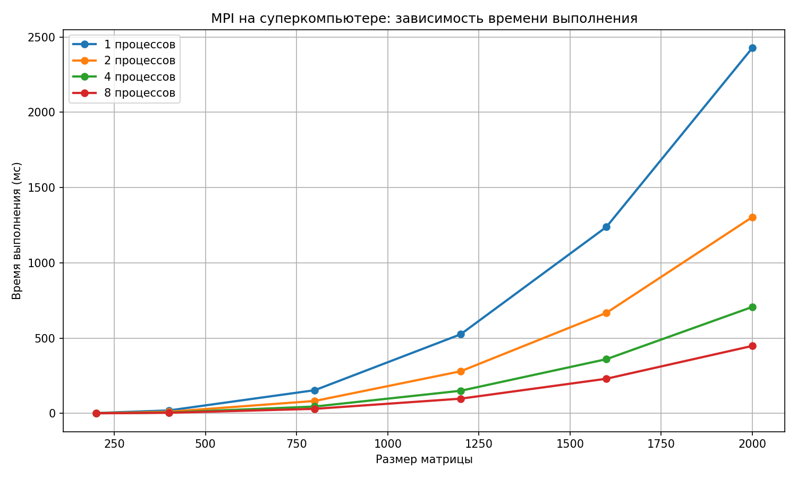

# Лабораторная работа №5: Параллельные вычисления с MPI на суперкомпьютере

## Цель работы

Исследовать масштабируемость параллельной программы умножения матриц с использованием технологии **MPI** при запуске на высокопроизводительном вычислительном кластере **«Сергей Павлович Королёв»**. Оценить влияние архитектуры суперкомпьютера на время выполнения.

---

## Экспериментальная установка

### - **Суперкомпьютер**: «Сергей Павлович Королёв»
### - **Количество процессов**: 1, 2, 4, 8
### - **Размеры матриц**: 200, 400, 800, 1200, 1600, 2000
### - **Измеряемая величина**: время выполнения (мс)

---

## Результаты экспериментов

| MatrixSize | Processes | ParallelTime_ms |
|------------|------------|-----------------|
| 200        | 1          | 2.46            |
| 200        | 2          | 1.29            |
| 200        | 4          | 0.81            |
| 200        | 8          | 0.50            |
| 400        | 1          | 19.56           |
| 400        | 2          | 10.91           |
| 400        | 4          | 5.73            |
| 400        | 8          | 3.97            |
| 800        | 1          | 154.12          |
| 800        | 2          | 82.51           |
| 800        | 4          | 45.55           |
| 800        | 8          | 30.30           |
| 1200       | 1          | 525.18          |
| 1200       | 2          | 279.65          |
| 1200       | 4          | 150.18          |
| 1200       | 8          | 97.69           |
| 1600       | 1          | 1238.79         |
| 1600       | 2          | 667.78          |
| 1600       | 4          | 360.13          |
| 1600       | 8          | 230.18          |
| 2000       | 1          | 2427.23         |
| 2000       | 2          | 1303.67         |
| 2000       | 4          | 706.88          |
| 2000       | 8          | 448.06          |

---

## График зависимости времени от размера матрицы

---

## Выводы

### 1. Ускорение работы программы на суперкомпьютере

Результаты показали, что при запуске программы на суперкомпьютере время выполнения заметно уменьшается по сравнению с обычным компьютером. Особенно это заметно для матриц большого размера.

### 2. Влияние количества процессов

При увеличении числа MPI-процессов время выполнения программы уменьшается. Лучшие результаты в проведённых экспериментах были получены при использовании 8 процессов.

### 3. Эффективность MPI

Параллельные вычисления с использованием MPI позволяют значительно ускорить умножение матриц. Для матрицы размером 2000×2000 программа выполнила вычисления менее чем за 0.5 секунды при использовании 8 процессов.
