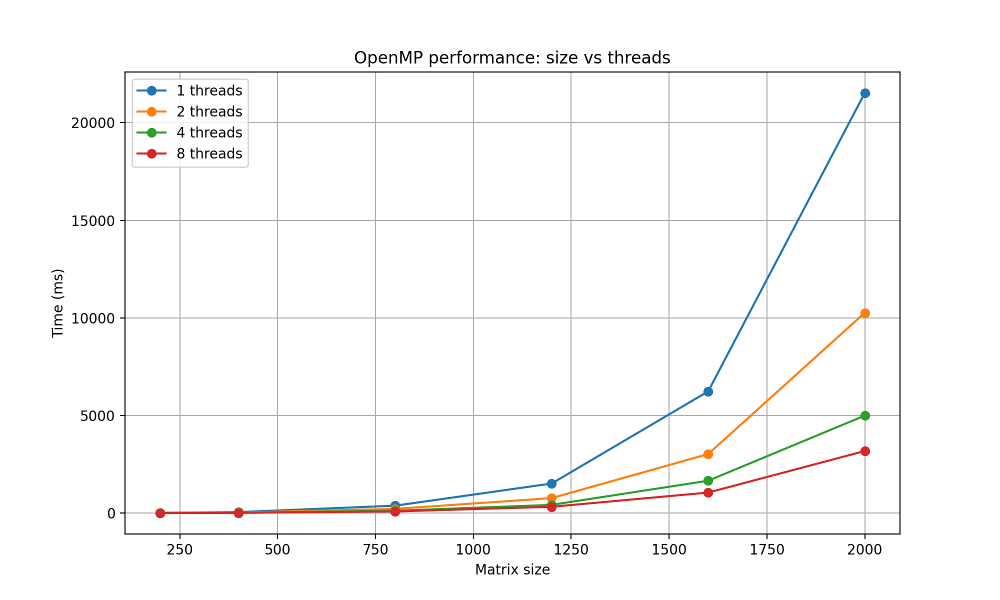

# **Лабораторная работа №2: Параллельные вычисления с OpenMP**

## Цель работы:

Модифицировать программу из лабораторной работы №1 (умножение матриц, или другая вычислительная задача) для параллельного выполнения с использованием технологии OpenMP. Провести серию экспериментов с разным количеством потоков (1, 2, 4, 8) и разными размерами матриц (200, 400, 800, 1200, 1600, 2000).

---

### Описание

Программа выполняет серию экспериментов для различных размеров матриц и различного количества потоков, после чего результаты сохраняются в CSV-файл и используются для построения графиков производительности.

---

# Экспериментальные параметры

| Параметр | Значения |
|---|---|
| Размеры матриц | 200, 400, 800, 1200, 1600, 2000 |
| Количество потоков | 1, 2, 4, 8 |
| Тип вычислений | Параллельное умножение матриц OpenMP |

---

# Структура проекта

- `main.cpp` — программа умножения матриц с использованием OpenMP
- `CMakeLists.txt` — файл для сборки проекта
- `generate.py` — генерация матриц для тестов
- `verify.py` — проверка правильности вычислений
- `plot.py` — построение графика по результатам экспериментов
- `results.csv` — сохранённые результаты измерений
- `lab2.png` — график времени выполнения программы
- `.gitignore` — исключение временных и служебных файлов

---

# Результаты экспериментов

В таблице ниже представлены результаты измерения времени выполнения программы (в миллисекундах) для различных размеров матриц и разного количества потоков OpenMP.

| Размер | Потоки | Время (мс) |
|--------|--------|------------|
| 200    | 1      | 5          |
| 200    | 2      | 3          |
| 200    | 4      | 1          |
| 200    | 8      | 1          |
| 400    | 1      | 48         |
| 400    | 2      | 25         |
| 400    | 4      | 13         |
| 400    | 8      | 10         |
| 800    | 1      | 376        |
| 800    | 2      | 213        |
| 800    | 4      | 117        |
| 800    | 8      | 81         |
| 1200   | 1      | 1511       |
| 1200   | 2      | 763        |
| 1200   | 4      | 418        |
| 1200   | 8      | 319        |
| 1600   | 1      | 6234       |
| 1600   | 2      | 3022       |
| 1600   | 4      | 1655       |
| 1600   | 8      | 1048       |
| 2000   | 1      | 21522      |
| 2000   | 2      | 10260      |
| 2000   | 4      | 4991       |
| 2000   | 8      | 3177       |

---

## **График зависимости времени от размера матрицы**

---

## Выводы

### 1. При увеличении размера матриц время выполнения программы значительно возрастает, что связано с высокой вычислительной сложностью умножения матриц.

### 2. Использование OpenMP позволяет существенно сократить время вычислений. Наибольшее ускорение наблюдается при использовании 8 потоков для матриц больших размеров.

---

## Сборка проекта (MSYS2 / MinGW)

### 1. Открыть терминал MSYS2 UCRT64

### 2. Перейти в папку проекта

### 3. g++ main.cpp -fopenmp -02 -o lab2.exe

### 4. python generate.py

### 5. ./lab2.exe

### 6. python plot.py

