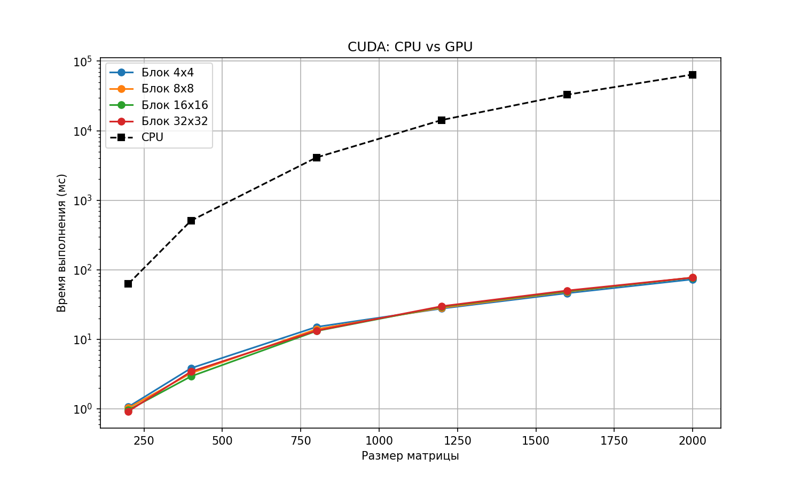

# Лабораторная работа №4 Параллельные вычисления с CUDA

## Цель работы

Модифицировать программу из лабораторной работы №1 (умножение матриц) для параллельного выполнения с использованием технологии CUDA на графическом процессоре (GPU). Провести серию экспериментов с разными конфигурациями блоков (4x4, 8x8, 16x16, 32x32) и разными размерами матриц (200, 400, 800, 1200, 1600, 2000).

---

## Экспериментальная среда
### Технология реализации CUDA CC++
### Размеры CUDA-блоков 4×4, 8×8, 16×16, 32×32
### Исследуемые размеры матриц 200, 400, 800, 1200, 1600, 2000
### Критерий сравнения время выполнения вычислений (мс)
### Аппаратное обеспечение видеокарта NVIDIA с поддержкой CUDA
### Средства разработки Visual Studio 2022 + CUDA Toolkit
### Компиляция программы NVIDIA CUDA Compiler (nvcc)

---

# Результаты экспериментов

| Размер | Блоки | Время GPU (мс) | Время CPU (мс) |
|--------|-------|----------------|----------------|
| 200    | 4x4   | 1.0678         | 62.69          |
| 200    | 8x8   | 1.0260         | 62.69          |
| 200    | 16x16 | 0.9600         | 62.69          |
| 200    | 32x32 | 0.9223         | 62.69          |
| 400    | 4x4   | 3.8417         | 509.17         |
| 400    | 8x8   | 3.2566         | 509.17         |
| 400    | 16x16 | 2.9306         | 509.17         |
| 400    | 32x32 | 3.4333         | 509.17         |
| 800    | 4x4   | 15.0568        | 4119.39        |
| 800    | 8x8   | 13.9743        | 4119.39        |
| 800    | 16x16 | 13.1456        | 4119.39        |
| 800    | 32x32 | 13.2995        | 4119.39        |
| 1200   | 4x4   | 27.7046        | 14261.0        |
| 1200   | 8x8   | 28.4330        | 14261.0        |
| 1200   | 16x16 | 29.4092        | 14261.0        |
| 1200   | 32x32 | 29.9047        | 14261.0        |
| 1600   | 4x4   | 46.0610        | 32994.0        |
| 1600   | 8x8   | 48.3535        | 32994.0        |
| 1600   | 16x16 | 49.1300        | 32994.0        |
| 1600   | 32x32 | 50.2560        | 32994.0        |
| 2000   | 4x4   | 72.8109        | 64219.6        |
| 2000   | 8x8   | 77.3668        | 64219.6        |
| 2000   | 16x16 | 76.9811        | 64219.6        |
| 2000   | 32x32 | 77.2143        | 64219.6        |    

---

## График зависимости времени от размера матрицы

---

## Выводы
### 1. Использование CUDA значительно ускоряет умножение матриц по сравнению с последовательной реализацией на CPU.

### 2. Конфигурация блока 4x4 показывает худшие результаты среди GPU-конфигураций.

### 3. Конфигурации 8x8, 16x16 и 32x32 демонстрируют близкую производительность.

### 4. Наибольший эффект параллельных вычислений наблюдается на больших матрицах.
