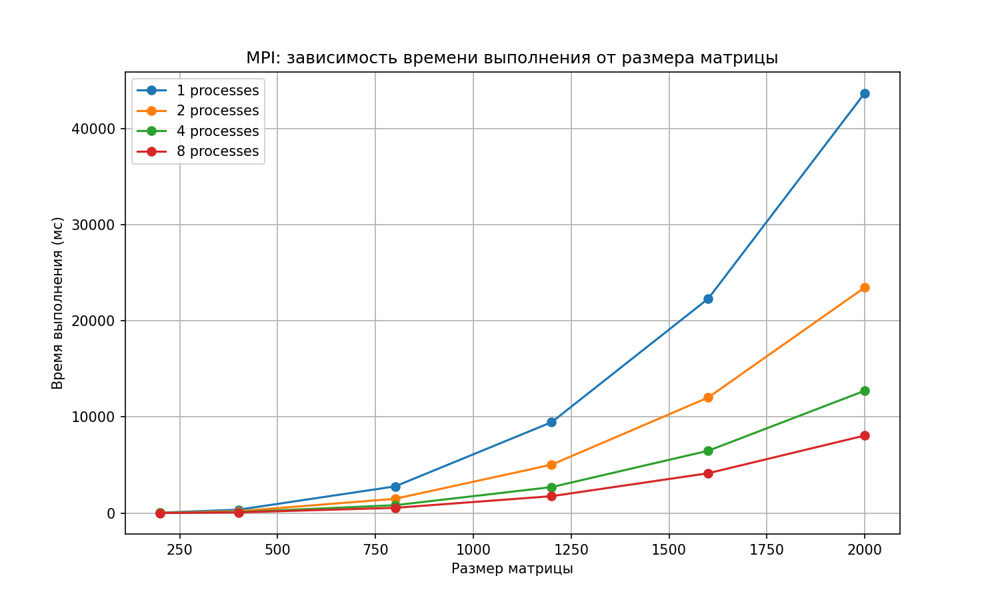

# **Лабораторная работа №3: Параллельные вычисления с MPI**

## Цель работы

Модифицировать программу из лабораторной работы №1 для параллельного выполнения с использованием технологии **MPI**. 
Провести серию экспериментов с разным количеством процессов (1, 2, 4, 8) и разными размерами матриц (200, 400, 800, 1200, 1600, 2000). 

---

### Экспериментальные параметры

| Параметр | Значения |
|----------|----------|
| Размеры матриц | 200, 400, 800, 1200, 1600, 2000 |
| Количество процессов | 1, 2, 4, 8 |
| Количество запусков | 6 |

---

В таблице приведены результаты измерений времени выполнения (в мс) для разных размеров матриц и числа процессов MPI. 

| Размер | Процессов | Время выполнения (мс) |
| ------ | --------- | --------------------- |
| 200    | 1         | 44.307                |
| 200    | 2         | 23.2889               |
| 200    | 4         | 14.6717               |
| 200    | 8         | 9.0095                |
| 400    | 1         | 352.136               |
| 400    | 2         | 196.469               |
| 400    | 4         | 103.101               |
| 400    | 8         | 71.5469               |
| 800    | 1         | 2774.09               |
| 800    | 2         | 1485.2                |
| 800    | 4         | 819.889               |
| 800    | 8         | 545.397               |
| 1200   | 1         | 9453.24               |
| 1200   | 2         | 5033.71               |
| 1200   | 4         | 2703.19               |
| 1200   | 8         | 1758.42               |
| 1600   | 1         | 22298.3               |
| 1600   | 2         | 12020                 |
| 1600   | 4         | 6482.27               |
| 1600   | 8         | 4143.27               |
| 2000   | 1         | 43690.1               |
| 2000   | 2         | 23466.1               |
| 2000   | 4         | 12723.8               |
| 2000   | 8         | 8065.04               |

---

## График зависимости времени от размера матрицы

---

## Выводы

### 1. Использование MPI значительно ускоряет умножение матриц

Во всех проведённых экспериментах увеличение количества процессов приводило к уменьшению времени выполнения программы. Особенно заметное ускорение наблюдается при работе с матрицами больших размеров — 800×800 и более.

### 2. Наибольший эффект параллелизации проявляется на больших данных

Для матриц размером 200×200 разница между количеством процессов относительно небольшая, однако при размерах 1200×1200, 1600×1600 и 2000×2000 выигрыш становится существенным. Например, для матрицы 2000×2000 время выполнения уменьшилось с 43690.1 мс при 1 процессе до 8065.04 мс при 8 процессах.

### 3. Оптимальное ускорение достигнуто при использовании 8 процессов

В данной системе наилучшие результаты были получены при использовании 8 MPI-процессов. Это связано с эффективным распределением строк матрицы между потоками вычислений и использованием всех доступных вычислительных ресурсов процессора.

### 4. MPI позволяет эффективно распределять вычислительную нагрузку

Реализованная программа успешно выполняет параллельное умножение матриц с использованием технологии MPI, демонстрируя хорошую масштабируемость и уменьшение времени выполнения при увеличении числа процессов.
